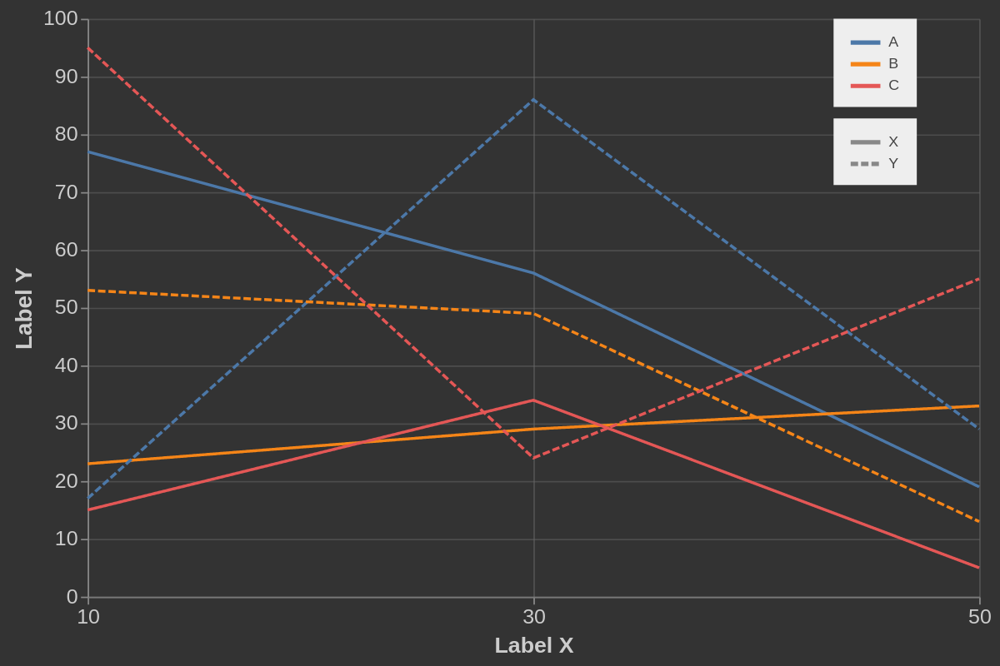

# EditorVega
Editor sencillo de gráficas en Vega/d3

La herramienta está montada [aquí](http://www.guilles.website/2019/01/08/editor-de-graficas-vega/). Para probarlo pueden generar la siguiente gráfica con los siguientes códigos:



Dataset:

```
a,b,c,d
A,10,77,X
A,30,56,X
A,50,19,X
B,10,23,X
B,30,29,X
B,50,33,X
C,10,15,X
C,30,34,X
C,50,5,X
A,10,17,Y
A,30,86,Y
A,50,29,Y
B,10,53,Y
B,30,49,Y
B,50,13,Y
C,10,95,Y
C,30,24,Y
C,50,55,Y
```

Specification:

```
{
  "$schema": "https://vega.github.io/schema/vega/v4.json",
  "width": 600,
  "height": 400,
  "padding": 5,
  "config": {
    "background": "#333",
    "axis": {
      "labelColor": "#ccc",
      "titleColor": "#ccc"
    },
    "legend": {
      "fillColor": "#eee", "padding": 10, "symbolOffset":10,
      "labelColor": "#444"
    }
  },
  "data": [
    { "name": "table",
      "format": {"type": "csv", "parse": "auto"},
      "transform": [
        { "type": "collect", "sort": {"field": "b", "order":"ascending"}
}
      ]
    }
  ],

  "scales": [
    {
      "name": "dashes",
      "type": "ordinal",
      "range": ["1,0", "5,2"],
      "domain": ["X", "Y"]
    },
    {
      "name": "x",
      "type": "point",
      "range": "width",
      "domain": {"data": "table", "field": "b"}
    },
    {
      "name": "y",
      "type": "linear",
      "range": "height",
      "nice": true,
      "zero": true,
      "domain": {"data": "table", "field": "c"}
    },
    {
      "name": "color",
      "type": "ordinal",
      "range": "category",
      "domain": {"data": "table", "field": "a"}
    }
  ],

  "axes": [
    {
      "orient": "bottom", "scale": "x",
      "labelFontSize": 14,
      "title": "Label X", "titleFontSize": 15,
      "grid":true,
      "gridOpacity": 0.6,
      "encode": {
          "grid": {
              "update": {
                "stroke": {"value": "#666"}
              }
          } 
       }
    },
    {
      "orient": "left", "scale": "y",
      "labelFontSize": 14,
      "title": "Label Y", "titleFontSize": 16,
      "grid": true,
      "encode": {
          "grid": {
              "update": {
                "stroke": {"value": "#666"},
                "opacity": {"value": 0.5}
              }
          } 
       }
    }
  ],

  "marks": [
    {
      "type": "group",
      "from": {
        "facet": {
          "name": "series",
          "data": "table",
          "groupby": ["a", "d"]
        }
      },
      "marks": [
        {
          "type": "line",
          "from": {
            "data": "series"
          },
          "encode": {
            "enter": {
              "x": {"scale": "x", "field": "b"},
              "y": {"scale": "y", "field": "c"},
              "stroke": {"scale": "color", "field": "a"},
              "strokeWidth": {"value": 2}, "strokeDash": {"scale": "dashes", "field":"d"} 
            },
            "hover": {
              "fillOpacity": {"value": 0.5}
            }
          }
        }
      ]
    }
  ],
  "legends": [
    {
      "stroke": "color",
      "encode": {
        "title": {
          "update": {
            "fontSize": {"value": 14}
          }
        }
      },
      "orient": "right",
      "offset": -100,
      "symbolType": "M-3,0H1",
      "symbolStrokeWidth": { "value": 3}
    },
    {
      "strokeDash": "dashes",
      "encode": {
        "title": {
          "update": {
            "fontSize": {"value": 14}
          }
        }
      },
      "orient": "right",
      "offset": -100,
      "symbolType": "M-3,0H1",
      "symbolStrokeWidth": { "value": 3}
    }
  ]
}
```
